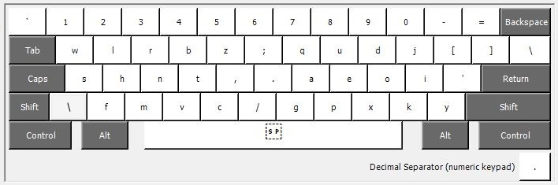
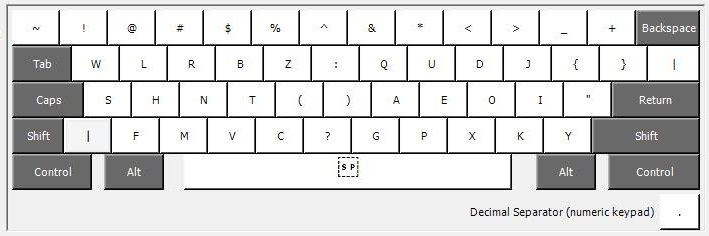
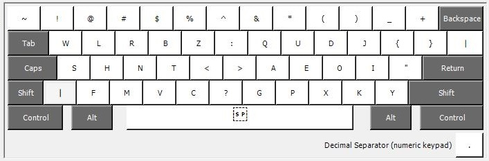
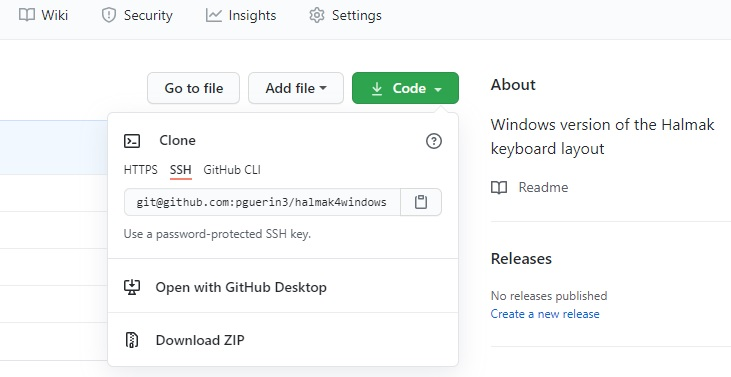

# The Halmak Keyboard Layouts for Windows

This repository is the Windows equivalent of the original Halmak Apple Mac version:
[halmak](https://github.com/MadRabbit/halmak)

This repository contains 4 Halmak layouts in 2 groups.
The groups are:
 * Halmak (featuring HalmakP and HalmakLG).
 * HalmaQ (featuring HalmaQP and HalmaQLG).

Note - HalmakQP and HalmaQLG map to the Qwerty layout for control characters.
This means undo (cntrl-z), cut (cntrl-x), copy (cntrl-c), and paste (cntrl-v) and the other control characters are in their original Qwerty positions on the keyboard.

Regardless of the group, the lettering of the Halmak layout is the same and is as follows:

### HalmakP and HalmaQP

This group has the Halmak layout with the parenthesis at the centre:
- HalmakP: features the parenthesis at the centre, and the Halmak cntrl keys.
- HalmaQP: features the parenthesis at the centre, and the Qwerty cntrl keys.

This means with the shift key modifier the layout is as follows:

### HalmakLG and HalmaQLG

This group has the Halmak layout with the less/greater signs at the centre:
- HalmakLG: features the less/greater at the centre, and the Halmak cntrl keys.
- HalmaQLG: features the less/greater at the centre, and the Qwerty cntrl keys.

This means with the shift key modifier the layout is as follows:

## Download

Click on the green 'code' button near the top of the page.

Then click 'Download ZIP'.

## Installation

Execute the setup for the layouts that interest you:
 - halmakP/setup.exe
 - halmakLG/setup.exe
 - halmaQP/setup.exe
 - halmaQLG/setup.exe
Install then try all the layouts to determined which is right for you.

## Switching between layouts

* Now setup the ability to choose and switch between QWERTY and your new layout. 
* Go to Control Panel > All Control Panel Items > Language > Advanced settings. 
* In the Switching Input Methods category, enable Use the desktop language bar when available.
* Choose Options

* Choose the Docked In The Taskbar option.

* Logout then login. There is no need to reboot.

* On startup you'll see the Input Method icon in the task bar. This can be set to instead show the Input Method icon in the top-right corner of the desktop where you'll be able to easily switch to either layout with the mouse. 

* Now you can switch at any time to the layout that you want.

## Uninstallation

* Choose the apps and features from the application launcher.

* Now you're free to uninstall any single layout at a time.

## Microsoft Keyboard Layout Creator (MSKLC) Version 1.4

The executables were created using the Microsoft Keyboard Layout Creator (MSKLC) Version 1.4.

[MSKLC - download](https://www.microsoft.com/en-us/download/details.aspx?id=102134)

## Copyright & License

Copyright (C) 2016 Nikolay Nemshilov

