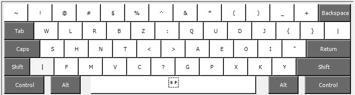

# Halmak Keyboard Layout for Windows

This repository is the Windows equivalent of the original Halmak Apple Mac version:
[halmak](https://github.com/MadRabbit/halmak)

## Installation

This repository contains 2 Halmak layouts:
- Halmak, which has the Halmak control character layout.
- HalmakQ, which retains the Qwerty control character layout.

* Git clone this repository.
* Execute either or both the following:
 - halmak/setup.exe
 - halmakQ/setup.exe

## Switching between layouts

* Now setup the ability to choose and switch between QWERTY and your new layout. 
* Go to Control Panel > All Control Panel Items > Language > Advanced settings. 
* In the Switching Input Methods category, enable Use the desktop language bar when available.
* Choose Options

* Choose the Docked In The Taskbar option.

* Logout then login. There is no need to reboot.

* On startup you'll see the Input Method icon in the task bar. This can be set to instead show the Input Method icon in the top-right corner of the desktop where you'll be able to easily switch to either layout with the mouse. 

* Now you can switch at any time to the layout that you want.

## Uninstallation

* Choose the apps and features from the application launcher.

* Now you're free to uninstall.

## Copyright & License

Again, I'm not sure if there is a point to this. But I guess it's MIT.

Copyright (C) 2016 Nikolay Nemshilov

## Microsoft Keyboard Layout Creator (MSKLC) Version 1.4
This Halmak setup executable was created using the Microsoft Keyboard Layout Creator (MSKLC) Version 1.4.

[MSKLC - download](https://www.microsoft.com/en-us/download/details.aspx?id=102134)
