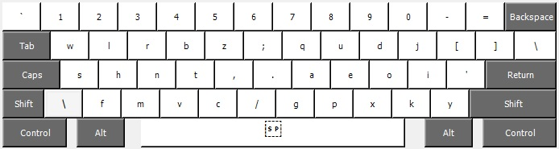
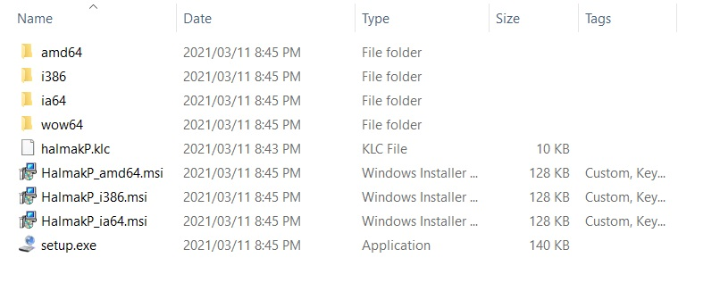
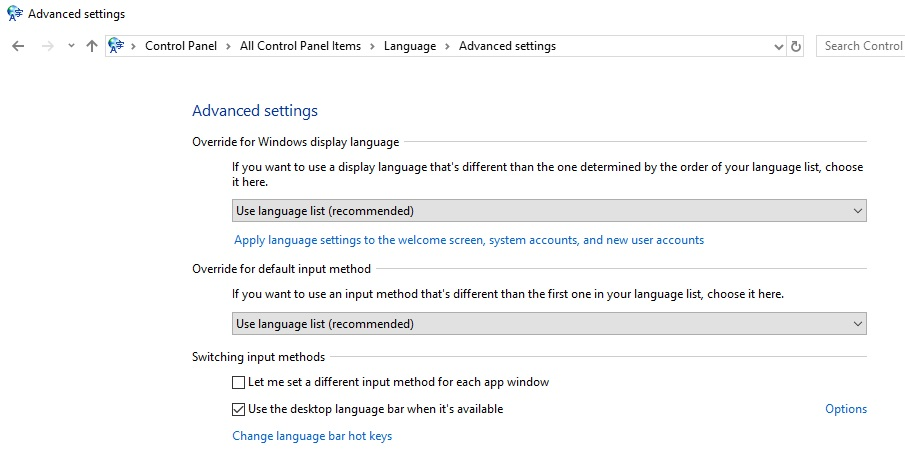
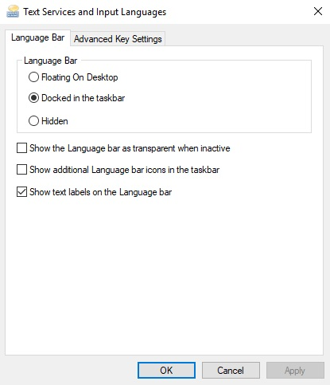
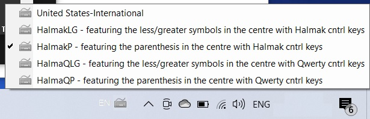
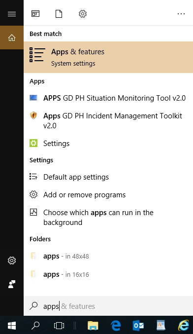
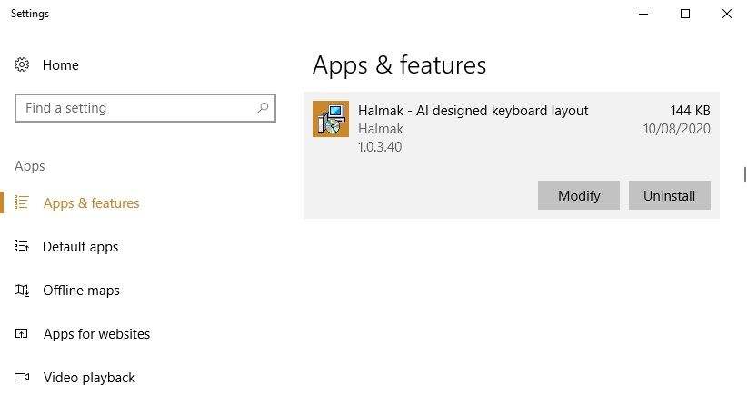

# Halmak Keyboard Layout for Windows

This is an AI designed keyboard layout that was built within the
[keyboard-gentics](https://github.com/MadRabbit/keyboard-genetics) project.
More details and a documented process can be found in
[this blog](http://nikolay.rocks/categories/optimal+keyboard)

This repository is the Windows equivalent of the original Halmak Apple Mac version:
[halmak](https://github.com/MadRabbit/halmak)

## Installation

* Git clone this repository.
* Execute setup.exe

May need to logout then login again

## Switching between layouts

Control Panel\All Control Panel Items\Language\Advanced settings

## Uninstallation

## Copyright & License

Again, I'm not sure if there is a point to this. But I guess it's MIT.

Copyright (C) 2016 Nikolay Nemshilov
